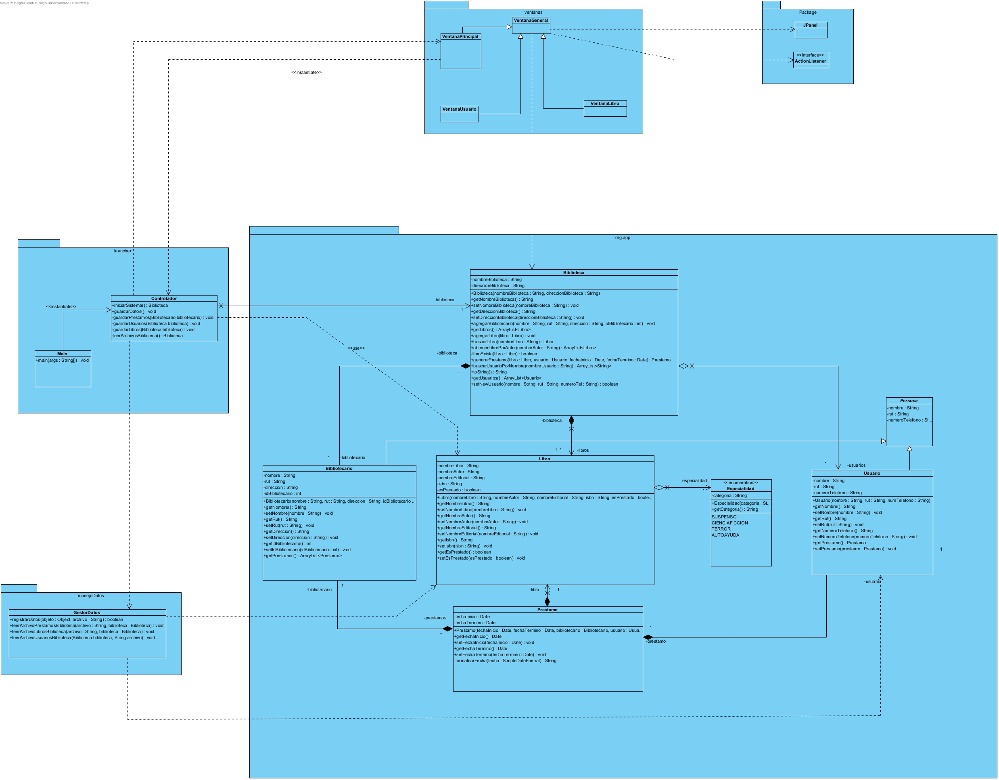

# Ayudantia 3 y 4 Biblioteca

Ayudantía 3: Actividad de POO sobre constructores, getters y setters  
Ayudantía 4: Actualización repositorio ayudantía 3. Actividad sobre relaciones entre clases (Asociación, agreción compocisión) y diagramas UML

---

### Relaciones entre las clases:

- `Biblioteca`: 
  - Composición con `Bibliotecario` de multiplicidad 1
  - Agregación con `Usuario` de multiplicidad 0 a muchos (*)
  - Composición unidireccional con `Libro` de multiplicidad 1 a *
- `Bibliotecario`:
  - Asociación con `Biblioteca` de multiplicidad 1
  - Asociación con `Prestamo` de multiplicidad 1
- `Libro`:
  - No tiene asociaciones con las demás clases (Existe por si sola)
- `Usuario`: 
  - Asociación con `Biblioteca` de multiplicidad 1
  - Asociación con `Prestamo` de multiplicidad 1
- `Prestamo`:
  - Composición con `Bibliotecario` de multiplicidad 1
  - Composición unidireccional con `Libro` de multiplicidad 1 a *
  - Composición con `Usuario` de multiplicidad 0 a 1

---

